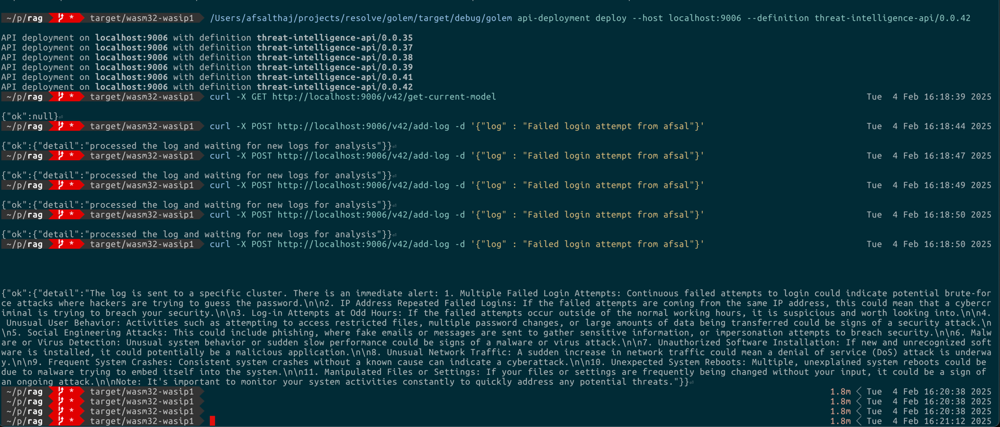
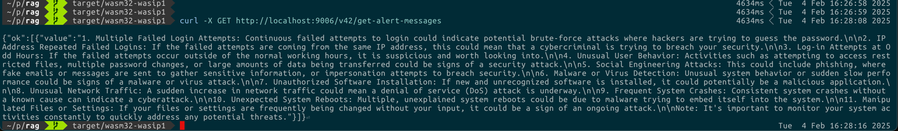
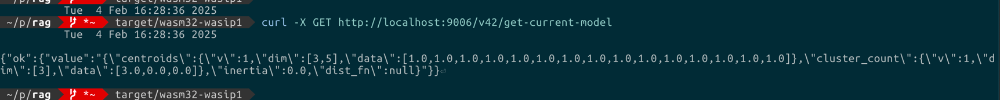

# Security Threat Intelligence with Golem with Distributed clustering and RAG with gpt-4

### Security Threat Intel

#### Log Processing Realtime Model Learning, Clustering, and Immediate Alert with LLM message



#### Accumulated alerts 


#### Updated Models


Allows easier log correlation and analysis to find security threats!

* Raw Event Ingestion: Firewall logs, endpoint logs, and DNS traffic are ingested directly into Golem nodes. This can be batch push to predefined set of workers. It doesn't really matter
* The pre-processor step of structred log-event is skipped in this project
* Without using a SIEM ((Security Information and Event Management), a very simple streaming clustering algorithm which is distributed to find centroids of various logs, backed by gpt-4 model with RAG to get proper alert message (after analysis).
* Cost effective and even more reliable due to reliability on ever-learning models in memory.
* LLM-Driven Analysis:The LLM analyzes these distributed events and suggests: "This appears to be a brute-force attack followed by privilege escalation and data exfiltration."

## Components and Responsibilities

### Oversimplified diagram

```shell
[Incoming Logs]
       |
       v
[Raw Component] --> (Batch Processing & Local Model) --> [Centroid Worker]
       |                                             |
       v                                             v
[Embedder Worker] <-- (Logs to Embeddings)        [Generic Model]
       |
       v
[Cluster Worker] --> (Maintains Context) --> [LLM Worker]
       |
       v
[Alert Generation & Log Correlation]

```

- **Raw Component**
    - Entry point to the pipeline.
    - Responsible for processing incoming logs.
    - Maintains internal state:
        - Batch size.
        - Local KMeans cluster model (for unsupervised learning).
        - Batch state.
    - Updates the local model once the total logs is greater than batch size. We create the model, and the batch is cleared!
    - If a model is created (local model), it sends the serialized form of this worker to the Centroid Worker.
    - For every log entry, attempts to send the local model and check for a generic model.
    - If a generic model is received, finds the membership of all accumulated logs.
    - Uses the Embedder Worker to convert logs to vector form before sending them to the Cluster Worker.

- **Centroid Worker**
    - Receives local models from the Raw Component.
    - Returns a generic model if enough local models are collected.
    - Facilitates distributed online/streaming KMeans clustering with Golem
    - This model is simply kept in memory and we keep updating this forever. 
    - We could also have 2 stages of this pipeline. "Develop" phase where model keeps getting trained and "Deploy" phase where logs will always fall into certain category. Probably not a great idea to develop until tested

- **Embedder Worker**
    - Converts logs to vector form (embedding).
    - This internally calls a server that's making use of some native dependencies.

- **Cluster Worker**
    - Once the raw workers have a generic model, they send the log message as well as the embedded form to the Cluster Worker.
    - Depending on the model there will be n number of these workers with the name "cluster_1", "cluster_2". Example: john_doe's login attempts, and geolocation and firewall logs will all be collected as part of a cluster.
    - Maintains previous log messages and their embeddings. This will server as the context for RAG analysis, allowing better inference from LLM model
    - Connects to the LLM Worker for further processing. LLM worker is kept separate

- **LLM Worker**
    - Responsible for sending the LLM prompt along with the previous context
    - Uses Retrieval-Augmented Generation (RAG) to improve the performance of large language models (LLMs) and offset hallucinations.

- **Alert Example**
    - Cluster worker keeps track of all alert messages and the collection of log messages, which can be retrieved at any time
    - "It looks like a user tried to log in after 10 attempts from an unknown geolocation."
    - Requests logs of failed attempts, firewall logs, and correlates timestamps.


## Workflow Summary

The Raw component, or rather the entry point to this pipeline, is responsible for processing incoming logs.

It keeps an internal state of "batch size," a local KMeans cluster model (for unsupervised learning), and, once the batch size is set, it will keep updating the model.

Meanwhile, it sends the details to a centroid worker, which receives this local model. This may or may not return a generic model. This is the place where we have the distributed online/streaming KMeans clustering.

A generic model will be created only if there are enough local models reaching the centroid worker. For every log entry in the raw worker, it will try to send the local model and see if it gets a generic model.

Both the local model state and generic model state, along with the batch state, are preserved and don't need any external data structure, as Golem is reliable.

If the addition of a log in the raw worker gets a generic model as part of the process, it tries to find the membership of all the logs accumulated until then in the raw node. For example, log 1 corresponds to cluster 1, and log 2 to cluster 2, and so on. Before it sends, it gets a vector form using the embedder server (which has some native dependencies) through the embedder worker. This means it talks to an embedder worker for each of these logs and then sends them to the cluster worker. Depending on the grouping, there will be many clusters.

The cluster keeps track of the previous log messages that are part of the cluster, along with their embeddings, and then connects to a worker called LLM, which is responsible for sending the LLM prompt. Since we are accumulating context, the prompt is more of a Retrieval-Augmented Generation (RAG), an AI architecture that improves the performance of large language models (LLMs) and offsets hallucinations of the model.

If there is an alert like "It looks like a user tried to log in after 10 attempts from an unknown geolocation," this requests the logs of failed attempts, firewall logs, and some correlation of timestamps.


## Log lines example:

### Succesful Login

```angular2html
2025-02-02 14:23:05 - User "johndoe" from IP 192.168.1.5 successfully logged in. Session ID: 2439847

```

#### Failed Login

```angular2html
2025-02-02 14:25:17 - Failed login attempt for user "janedoe" from IP 10.0.0.55. Incorrect password.

```

#### Unusual Login Time (Suspicious)

```angular2html
2025-02-02 03:47:20 - User "richardb" from IP 203.0.113.12 successfully logged in. Session ID: 7894561

```

####  Multiple Failed Login Attempts (Suspicious)
````angular2html

2025-02-02 14:30:10 - Failed login attempt for user "charlesh" from IP 192.168.1.11. Incorrect password.
2025-02-02 14:30:20 - Failed login attempt for user "charlesh" from IP 192.168.1.11. Incorrect password.
2025-02-02 14:30:30 - Failed login attempt for user "charlesh" from IP 192.168.1.11. Incorrect password.

````

#### Suspicious File Access

```angular2html 
2025-02-02 15:12:03 - User "emilyw" accessed sensitive file "customer_bank_accounts.csv" from IP 198.51.100.7.

```

####  Normal Account Access (Benign)

```angular2html
2025-02-02 14:10:25 - User "alexs" successfully accessed account details. Session ID: 1298765

```

#### Large Fund Transfer (Suspicious)

```angular2html
2025-02-02 15:20:45 - User "bobp" transferred $500,000 to a new account. Transaction ID: 55596734

```

#### Unusual DNS Query (Suspicious)

```angular2html
2025-02-02 15:15:30 - DNS query for "paymentprocessing.xyz" from IP 203.0.113.42

```

#### Unusual Geolocation Login (Suspicious)

```angular2html
2025-02-02 13:02:05 - User "gracej" successfully logged in from IP 100.200.300.400 (Unknown Geolocation).

```

### Multiple Device Logins (Suspcious)

```angular2html
2025-02-02 15:25:10 - User "johndoe" logged in from device "WindowsPC" (IP: 192.168.0.15).
2025-02-02 15:25:30 - User "johndoe" logged in from device "MobileApp" (IP: 192.168.0.15).

```

### Why I think I am choosing clustering?

I am no expert here, but it looks there are proven papers on distributed clustering: 
Especially KMeans have a distributed form: http://www.cs.cmu.edu/~ninamf/papers/distr_clust.pdf
and then a general distributed clustering with https://arxiv.org/pdf/1802.00304


This can be quite an interesting approach in Golem where both intermediate and final centroids can be in-state
without the need of storing things anywhere, when it comes to "streaming clustering" (it's the raw meaning of online clustering).
It also looks like we can in-fact do distributed clustering with streaming


### A few thoughts before I chose this approach to group logs?
Unsupervised learning and security threats go hand in hand. Yes, there are various pre-defined labels in
security threats (suspicious large money transfer, or multiple failed login attempts), but there are numerous
patterns that a smart attacker can use to bypass the security measures. These can't be labelled beyond an extent.
Probably we can do supervised learnings for basic stuff, and then it has to be somewhere along the lines of unsupervised learnings as we progress.

Within a short span, its hard to cover both these patterns, but let's just simply focus on unsupervised
clustering of related logs and these clusters are indeed a worker or a group of similar workers identifiable.
