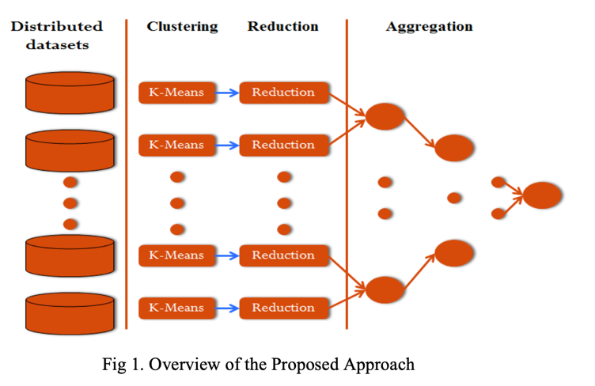

### Security Threat Intelligence with Golem, leveraging RAG and LLaMA 2

### Example of a Unique Golem Workflow (Without SIEM Involvement):

* Raw Event Ingestion: Firewall logs, endpoint logs, and DNS traffic are ingested directly into Golem nodes.
* Decentralized Parsing & Classification: ach worker parses logs and classifies events (failed logins, suspicious file access, unusual DNS queries) without a SIEM.
* Cross-Node Correlation: Workers exchange lightweight metadata (e.g., hashes, anonymized user IDs) to identify patterns across nodes. For instance, Node A detects failed logins from a suspicious IP, and Node B detects malware activity tied to the same user account.
* LLM-Driven Analysis:The LLM analyzes these distributed events and suggests: "This appears to be a brute-force attack followed by privilege escalation and data exfiltration."
* Automated Mitigation Recommendations:Golem suggests specific actions like isolating affected machines, revoking compromised credentials, etc.


Log lines example:

### Succesful Login

```angular2html
2025-02-02 14:23:05 - User "johndoe" from IP 192.168.1.5 successfully logged in. Session ID: 2439847

```

#### Failed Login

```angular2html
2025-02-02 14:25:17 - Failed login attempt for user "janedoe" from IP 10.0.0.55. Incorrect password.

```

#### Unusual Login Time (Suspicious)

```angular2html
2025-02-02 03:47:20 - User "richardb" from IP 203.0.113.12 successfully logged in. Session ID: 7894561

```

####  Multiple Failed Login Attempts (Suspicious)
````angular2html

2025-02-02 14:30:10 - Failed login attempt for user "charlesh" from IP 192.168.1.11. Incorrect password.
2025-02-02 14:30:20 - Failed login attempt for user "charlesh" from IP 192.168.1.11. Incorrect password.
2025-02-02 14:30:30 - Failed login attempt for user "charlesh" from IP 192.168.1.11. Incorrect password.

````

#### Suspicious File Access

```angular2html 
2025-02-02 15:12:03 - User "emilyw" accessed sensitive file "customer_bank_accounts.csv" from IP 198.51.100.7.

```

####  Normal Account Access (Benign)

```angular2html
2025-02-02 14:10:25 - User "alexs" successfully accessed account details. Session ID: 1298765

```

#### Large Fund Transfer (Suspicious)

```angular2html
2025-02-02 15:20:45 - User "bobp" transferred $500,000 to a new account. Transaction ID: 55596734

```

#### Unusual DNS Query (Suspicious)

```angular2html
2025-02-02 15:15:30 - DNS query for "paymentprocessing.xyz" from IP 203.0.113.42

```

#### Unusual Geolocation Login (Suspicious)

```angular2html
2025-02-02 13:02:05 - User "gracej" successfully logged in from IP 100.200.300.400 (Unknown Geolocation).

```

### Multiple Device Logins (Suspcious)

```angular2html
2025-02-02 15:25:10 - User "johndoe" logged in from device "WindowsPC" (IP: 192.168.0.15).
2025-02-02 15:25:30 - User "johndoe" logged in from device "MobileApp" (IP: 192.168.0.15).

```

### Why I think I am choosing clustering?

I am no expert here, but it looks there are proven papers on distributed clustering: 
Especially KMeans have a distributed form: http://www.cs.cmu.edu/~ninamf/papers/distr_clust.pdf
and then a general distributed clustering with https://arxiv.org/pdf/1802.00304




This can be quite an interesting approach in Golem where both intermediate and final centroids can be in-state
without the need of storing things anywhere, when it comes to "streaming clustering" (it's the raw meaning of online clustering).
It also looks like we can in-fact do distributed clustering with streaming


### A few thoughts before I chose this approach to group logs?
Unsupervised learning and security threats go hand in hand. Yes, there are various pre-defined labels in
security threats (suspicious large money transfer, or multiple failed login attempts), but there are numerous
patterns that a smart attacker can use to bypass the security measures. These can't be labelled beyond an extent.
Probably we can do supervised learnings for basic stuff, and then it has to be somewhere along the lines of unsupervised learnings as we progress.

Within a short span, its hard to cover both these patterns, but let's just simply focus on unsupervised
clustering of related logs and these clusters are indeed a worker or a group of similar workers identifiable.
